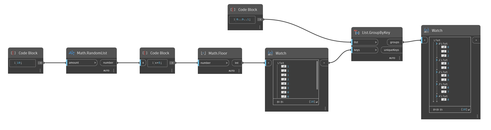

## In Depth
`List.GroupByKey` groups items from an input list based on a list of keys. The list of keys should have the same number of elements as the input list. Items in the original list that correspond to matching keys are grouped together in an output list.  

In the example below, we use a range of numbers between 0 and 9 as the input list. We also generate a list of 10 random numbers between 0 and 4 to use as the keys. `List.GroupByKey` outputs a nested list of elements, grouped according to the corresponding key. It also outputs a list of the unique keys.
___
## Example File

