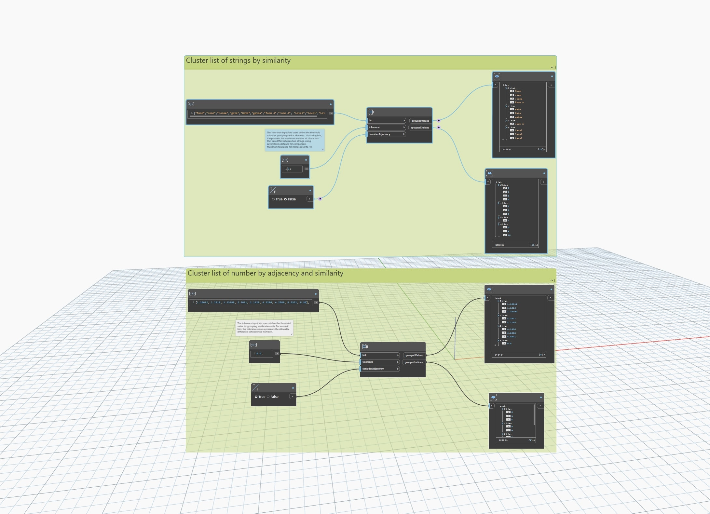

## In Depth
`List.GroupBySimilarity` clusters list elements based on the adjacency of their indices and the similarity of their values. The list of elements to be clustered can contain either numbers (integers and floating-point numbers) or strings, but not a mix of both. 

Use the `tolerance` input to determine the similarity of elements. For lists of numbers, this is a numeric tolerance specifying the maximum allowable difference between adjacent elements for them to be considered similar. For lists of strings, this is a decimal value (between 0 and 1) specifying the minimum similarity ratio (computed using fuzzy logic) for adjacent elements to be considered similar.

The `considerAdjacency` Boolean input indicates whether adjacency should be considered when clustering the elements. If True, only adjacent elements that are similar will be clustered together. If False, similarity alone will be used to form clusters, regardless of adjacency. 

The node outputs a list of lists of clustered values based on adjacency and similarly, as well as a list of lists of the indices of the clustered elements in the original list.
___
## Example File

