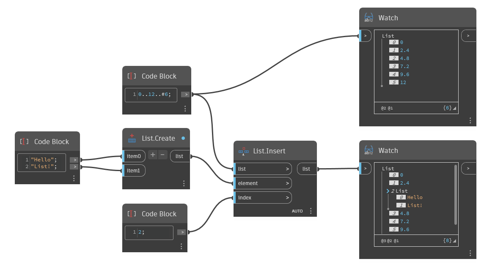

## In Depth
`List.Insert` places multiple elements into a list at a given index. 

In the example below, a list containing two strings, "Hello" and "List!", is inserted at index value 2 as a sublist, producing a new list that is one index longer than the original list.

___
## Example File

