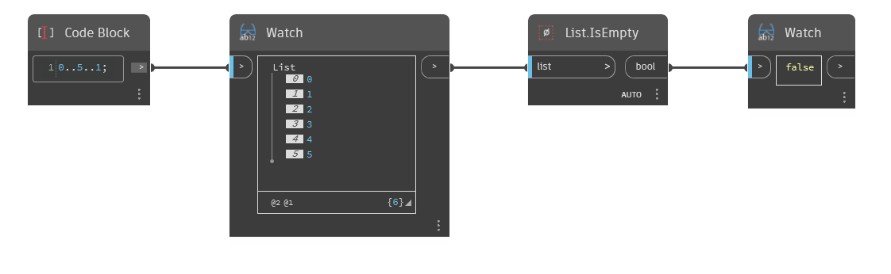

## In Depth
`List.IsEmpty` returns a Boolean value of True if the input list is empty, and False if it’s not empty.

In the example below, we first use a code block to generate a range of numbers from 0 to 5, stepping by 1. We input this list into an `List.IsEmpty` node. Since the list is not empty, `List.IsEmpty` returns a False value.
___
## Example File

