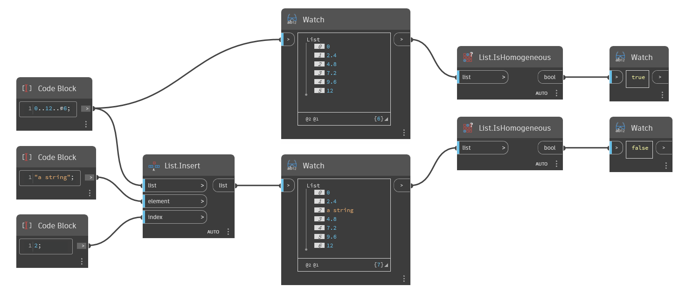

## In Depth
`List.IsHomogeneous` returns a Boolean value based on whether the elements in a list are all of the same type. 

In the example below, a simple list of numbers is compared to the same list with a string inserted. The original list is homogeneous (numbers only), so `List.IsHomogeneous` returns True. The new list is not homogeneous (numbers and a string), so `List.IsHomogeneous` returns False.
___
## Example File

