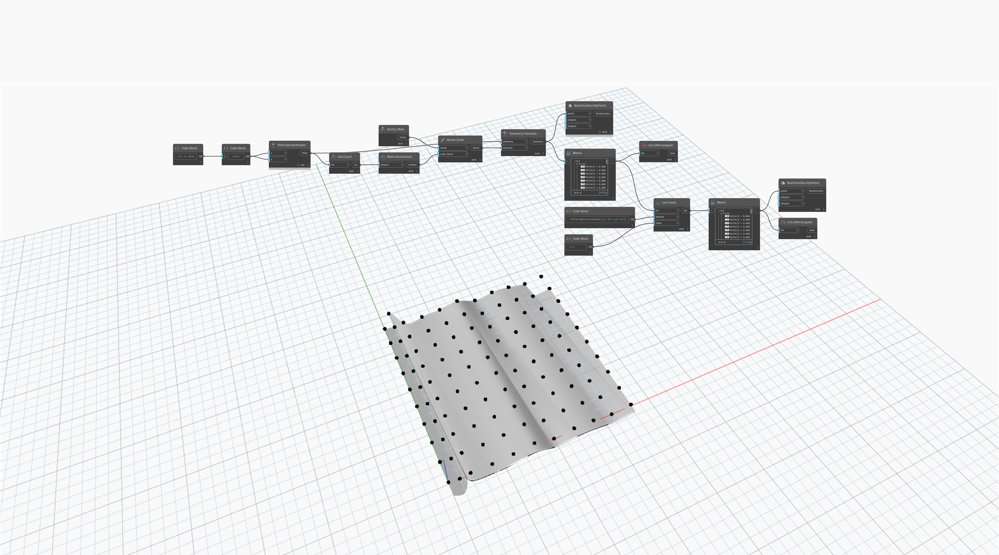

## In Depth
`List.IsRectangular` returns a Boolean value based on whether a list's rows have the same number of elements. 

In the example below, a False value is returned for a grid of points with an extra point added to a row. A NurbsSurface can be created from an irregular point collection, but it may not behave as expected. 
___
## Example File

