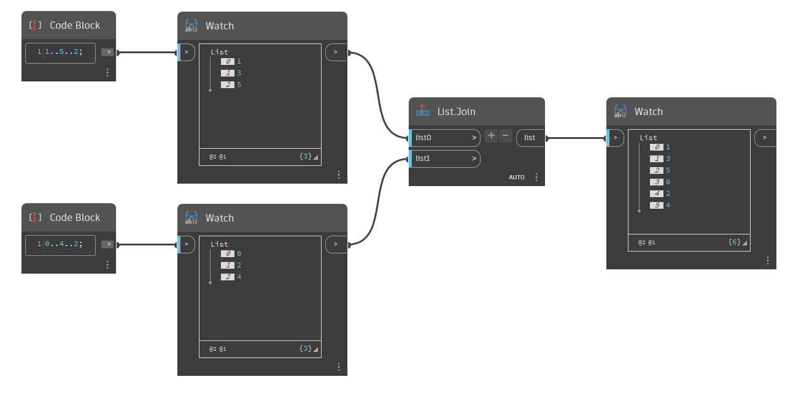

## In Depth
`List.Join` combines the input lists into a single list. You can adjust the number of input lists by using the + and - buttons on the Join node.

In the example below, we first use two code blocks to generate two ranges of numbers. The first list is odd numbers [1,3,5], and the second is even numbers [0,2,4]. With the `List.Join` node, we can join these two lists into a single list [1,3,5,0,2,4]. 

___
## Example File

