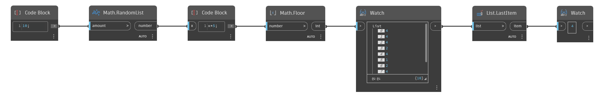

## In Depth
`List.LastItem` returns the last item in an input list. 

In the example below, we generate a list of 10 random numbers between 0 and 5. We then use a `List.LastItem` node to return the last item of the list.
___
## Example File

