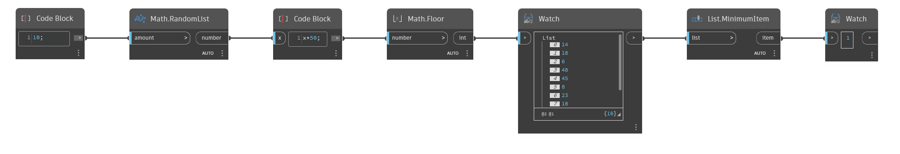

## In Depth
`List.MinimumItem` searches through a list of values and returns the item with the smallest value. 

In the example below, we generate a list of 10 random numbers between 0 and 49. We then use a `MinimumItem` node to find the smallest item in the list.
___
## Example File

