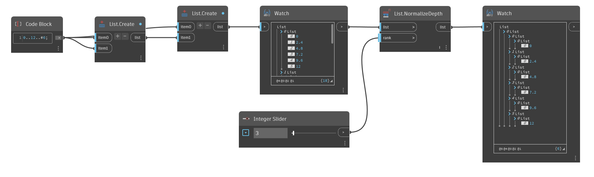

## In Depth
`List.NormalizeDepth` returns a new list of uniform depth to a specified rank, or list depth.

Like `List.Flatten`, you can use `List.NormalizeDepth` to return a one-dimensional list (a list with a single level). But you can also use it to add list levels. The node normalizes the input list to a depth of your choosing.

In the example below, a list containing 2 lists of unequal depth can be normalized to different ranks with an integer slider. By normalizing the depths at different ranks, the list increases or decreases in depth, but is always uniform. A list of rank 1 returns a single list of elements, while a list of rank 3 returns 2 levels of sublists. 
___
## Example File

