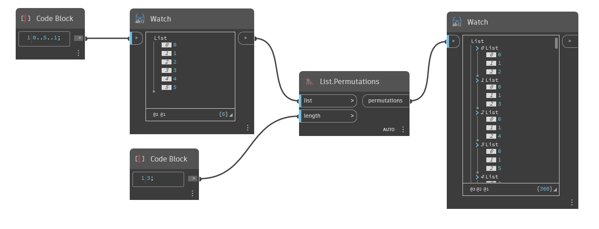

## In Depth
`List.Permutations` creates a nested list consisting of all permutations of a given length from a given input list. 

In the example below, we use a code block to create a range of numbers from 0 to 5, stepping by 1. We then use a `List.Permutations` node with a Length input of 3 to generate all permutations of 3 elements from the range [0,1,2,3,4,5].
___
## Example File

