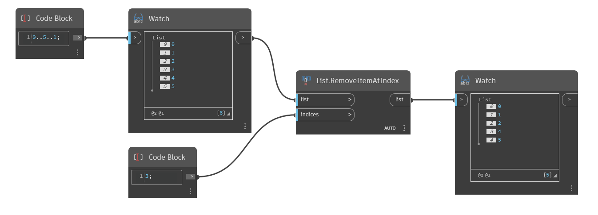

## In Depth
`List.RemoveItemAtIndex` removes items from an input list at a given index or indices. 

In the example below, we start with a range of numbers from 0 to 5. We then remove the item with index 3.
___
## Example File

