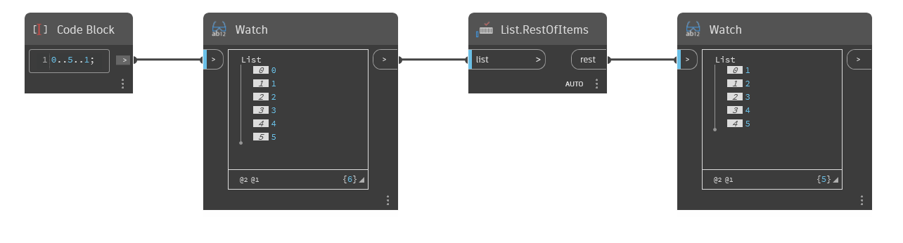

## In Depth
`List.RestOfItems` removes the first element from a list and returns the remaining elements in a new list. 

In the example below, we start with a range of numbers from 0 to 5, stepping by 1. By using a `List.RestOfItems` node, we remove the first item on the list, and the output is a list of numbers from 1 to 5.
___
## Example File

