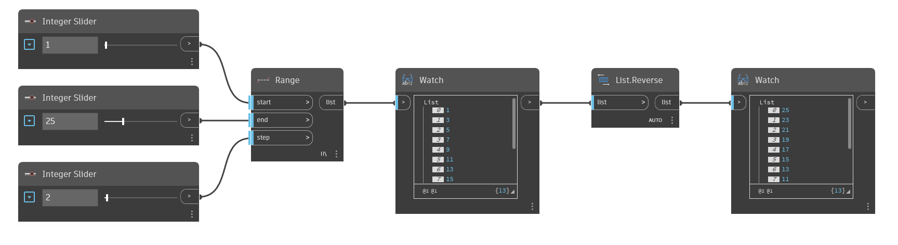

## In Depth
`List.Reverse` takes the items in a list and creates a new list with the order of items reversed. 

In the example, we first generate a list using `Range`, which produces numbers in increasing order. Then, we use `List.Reverse` to switch the order of the items in the list.
___
## Example File

