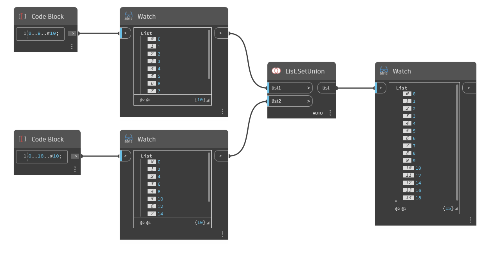

## In Depth
`List.SetUnion` returns a new list by combining the objects of two input lists and eliminating duplicate values. 

In the example below, a list of 0 to 9, stepping by 1, is combined with a list of 0 to 18, stepping by 2. The resulting list contains all elements from List1 and List2 with duplicates (0, 2, 4, etc.) eliminated.
___
## Example File

