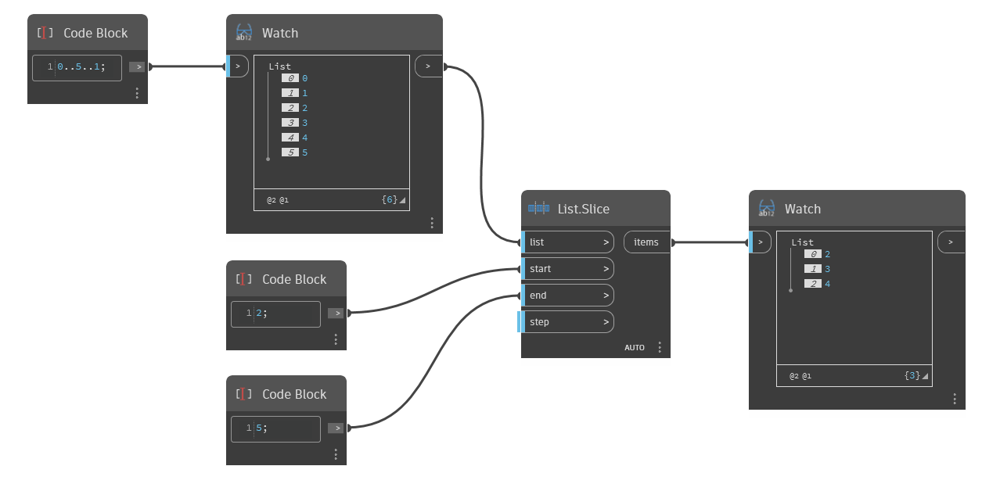

## In Depth
`List.Slice` returns a sublist from an input list based on a given start, end, and step. The `start` input specifies the starting index of the output list. The `end` input specifies its ending index. This index is not included in the output list. The `step` input determines the number of indices separating the list items. By default, this is 1.

In the example below, using a start index of 2 and an end index of 5 results in a new list consisting of the items with indices 2, 3, and 4 from the original list.
___
## Example File

