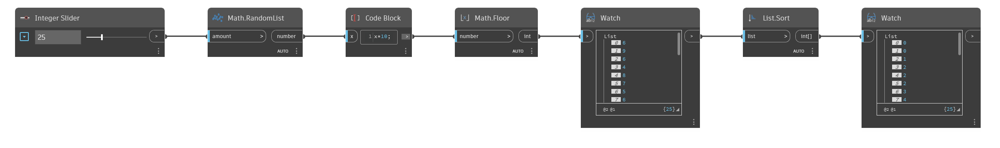

## In Depth
`List.Sort` organizes a list of items according to the built-in ordering for the data type. For example, a list of numbers is sorted from smallest to largest, while a list of strings is sorted alphabetically. 

In the example below, we use `Math.RandomList` to first generate a list of random numbers between 0 and 1. We then multiply by 10 and use a `Math.Floor` operation to get a list of random integers between 0 and 9. `List.Sort` then creates a sorted list from smallest to largest number.
___
## Example File

