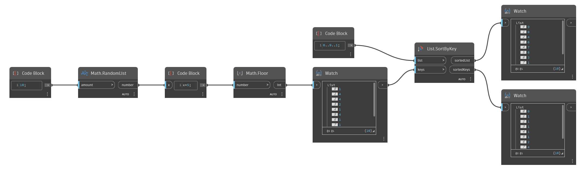

## In Depth
`List.SortByKey` takes an input list to sort and a list of corresponding sortable keys, such as numbers or strings. `List.SortByKey` sorts the list of keys in ascending order and rearranges the input list to correspond to the new order of the sorted keys. This node outputs both the rearranged list and the sorted list of keys. 

In the example below, we use a range from 0 to 9 as our input list. For the list of keys, we generate a list of 10 random numbers between 0 and 4. The list of keys is sorted numerically, while the range from 0 to 9 is rearranged according to the order of the corresponding elements from the list of keys.
___
## Example File

