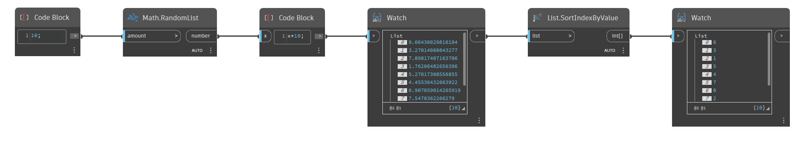

## In Depth
`List.SortIndexByValue` returns a list of indices sorted by their member’s values in ascending order. 

In the example below, a list of random numbers is sorted and a new order is returned as index values.
___
## Example File

