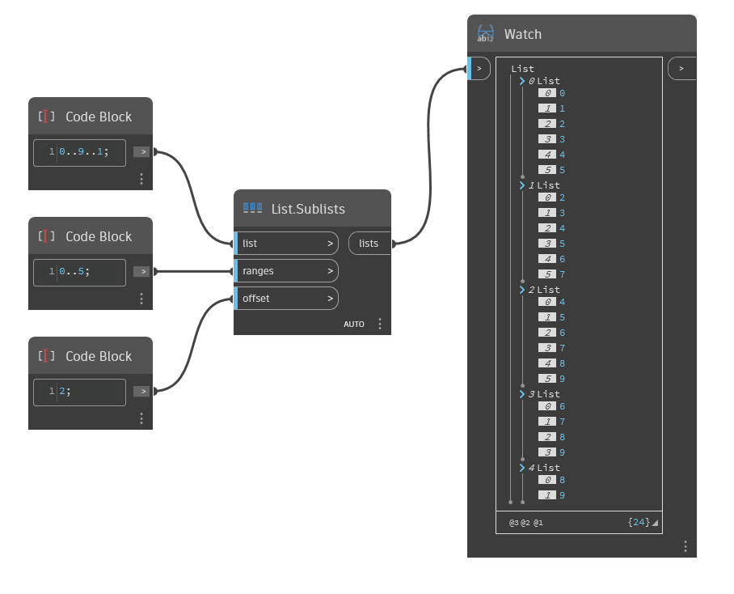

## In Depth
`List.Sublists` returns a series of sublists from a given list based on the input range and offset. The range determines the elements of the input list that are placed into the first sublist. An offset is applied to the range, and the new range determines the second sublist. This process repeats, increasing the starting index of the range by the given offset until the resulting sublist is empty. 

In the example below, we start with a range of numbers from 0 to 9. The range 0 to 5 is used as the sublist range, with an offset of 2. In the output of nested sublists, the first list contains the elements with indices in the range 0..5, and the second list contains the elements with indices 2..7. As this is repeated, the subsequent sublists become shorter as the end of the range exceeds the length of the initial list.
___
## Example File

