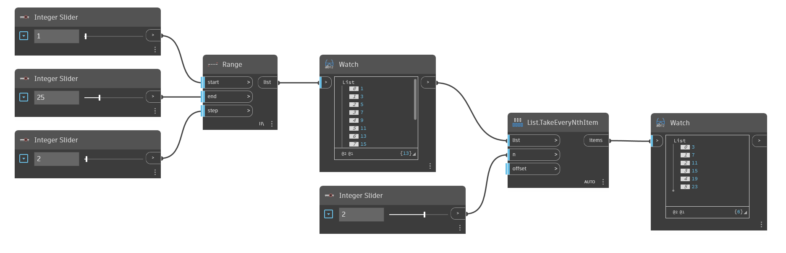

## In Depth
`List.TakeEveryNthItem` produces a new list containing only the items from the input list that are at intervals of the input n value. The starting point of the interval can be changed with the `offset` input. For example, inputting 3 into n and leaving the offset as the default of 0 will keep items with indices 2, 5, 8, etc. With an offset of 1, items with indices 0, 3, 6, etc. are kept. Note that the offset “wraps” through the entire list. To remove selected items instead of keeping them, see `List.DropEveryNthItem`. 

In the example below, we first generate a list of numbers using `Range`, and then keep every other number by using 2 as the input for n.
___
## Example File

