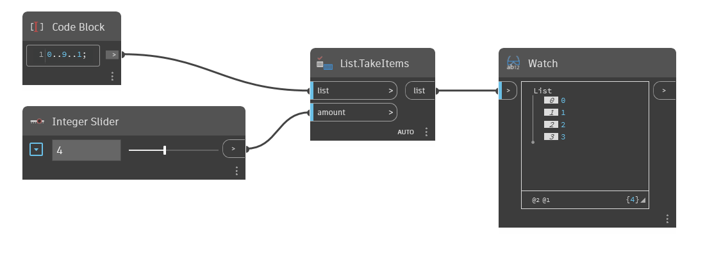

## In Depth
`List.TakeItems` returns a given number of items from the beginning of the input list.    If the `amount` input is negative, the items are taken from the end of the list in reverse order.

In the example below, we start with a range of numbers from 0 to 9, stepping by 1. We use an integer slider for the `amount` input to specify the number of elements to take from the original list. With an input of 4, the output list contains the first 4 elements from the original list.
___
## Example File

