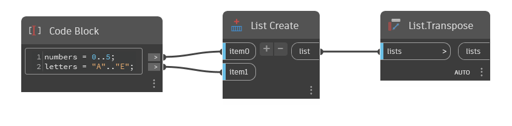

## In Depth
`List.Transpose` swaps the rows and columns in a list of lists. For example, a list that contains 5 sublists of 10 items each would be transposed to 10 lists of 5 items each. Null values are inserted as needed to ensure that each sublist has the same number of items.

In the example, we generate a list of numbers from 0 to 5 and another list of letters from A to E. We then use `List.Create` to combine them. `List.Transpose` generates 6 lists of 2 items each, one number and one letter per list. Notice that since one of the original lists was longer than the other, `List.Transpose` inserted a null value for the unpaired item. 
___
## Example File

