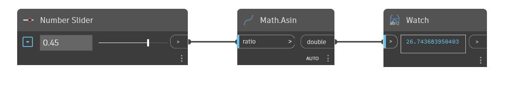

## In Depth
Asin will return the inverse sine, also known as the ArcSine, of an input number between -1 and 1. This output angle is returned in degrees. In the example below we use a number slider set to the range -1 to 1 to control the input to an Asin node.
___
## Example File

