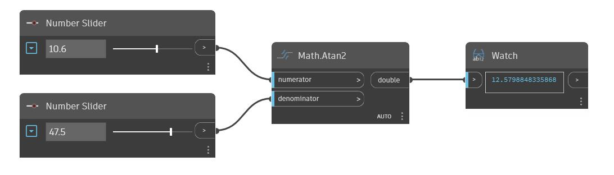

## In Depth
Atan2 will return the inverse sine, also known as the ArcTangen, of the ratio of an input numerator and denomnator. This output angle is returned in degrees. In the example below we use two number sliders to control the inputs to an Atan2 node.
___
## Example File

