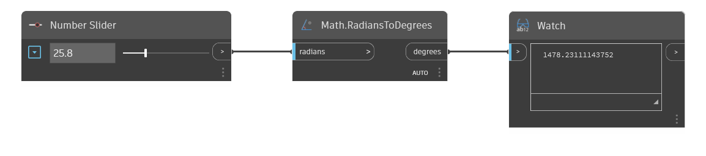

## In Depth
Math.RadiansToDegrees will convert an input angle from radians to degrees. In the example below, we use a number slider to control the input angle to a RadiansToDegrees node.
___
## Example File

