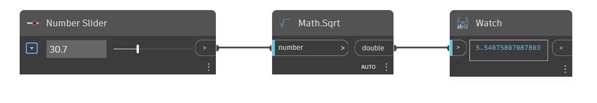

## In Depth
Sqrt will return the square root of an input number. Sqrt will only accept positive numbers. In the example below we use a number slider to control the input to a Sqrt node.
___
## Example File

