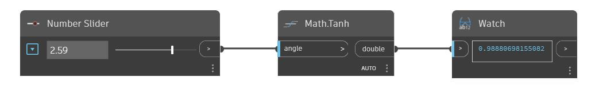

## In Depth
Tanh will return the hyperbolic tangent of an input angle in radians. In the example below, we use a number slider set to the range -6.28 to 6.28 to control the input angle to a Tanh node.
___
## Example File

