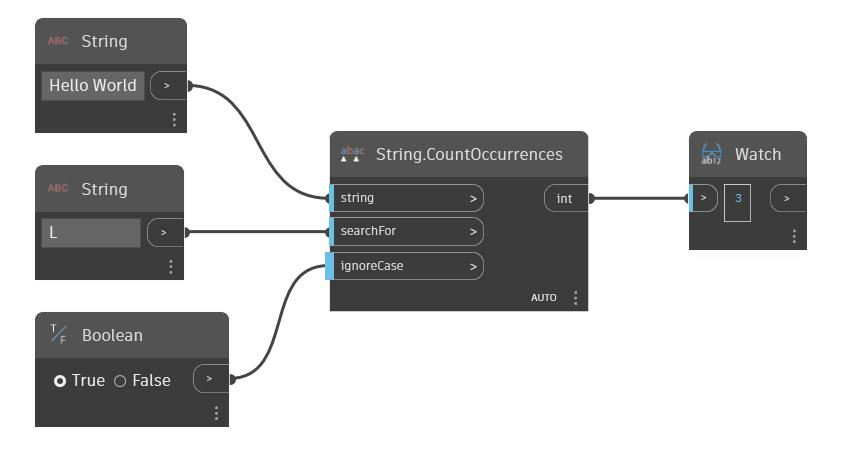

## In Depth
Count Occurrences will search a given string for a second input string, and will return the number of times that second string is found within the first string. By default this node is case sensitive. A boolean value can be used in the 'ignoreCase' input to make the node ignore the case of the strings. In the example below, we using the string 'Hello World' and search for the string 'L'. Because ignoreCase is set to true, the CountOccurrences finds the given string three times within 'Hello World'.
___
## Example File

