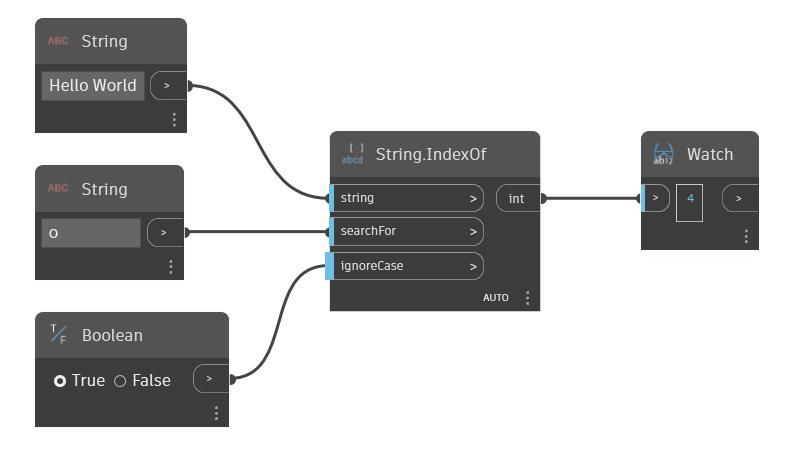

## In Depth
IndexOf will search a given string for a second input string. If the second string is found, this node will return the index of the first character of the first occurrence of the string.  By default this node is case sensitive. A boolean value can be used in the 'ignoreCase' input to make the node ignore the case of the strings. In the example below, we use the string 'Hello World', and search for the character 'o', This letter occurs twice in the string, but only the index of the first occurrence is returned by the IndexOf node.
___
## Example File

