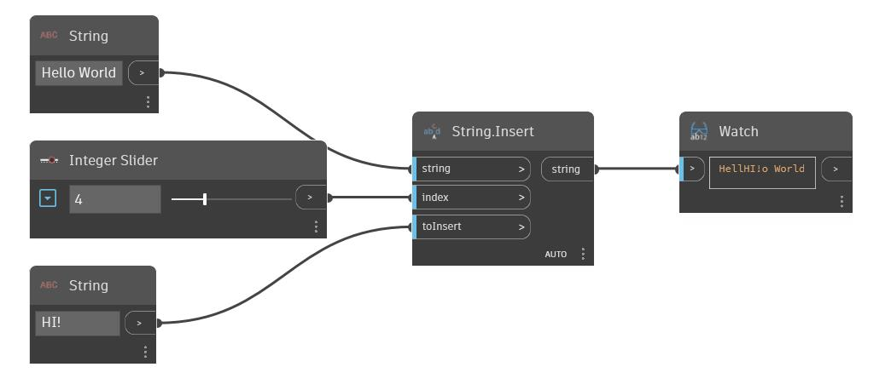

## In Depth
Insert will insert a given string into a base string at a specified index. In the example below, we start with the base string 'Hello World'. We use a second string 'Hi!' as the string to insert. An integery slider is used to control the index at which the second string will be inserted into the base string.
___
## Example File

