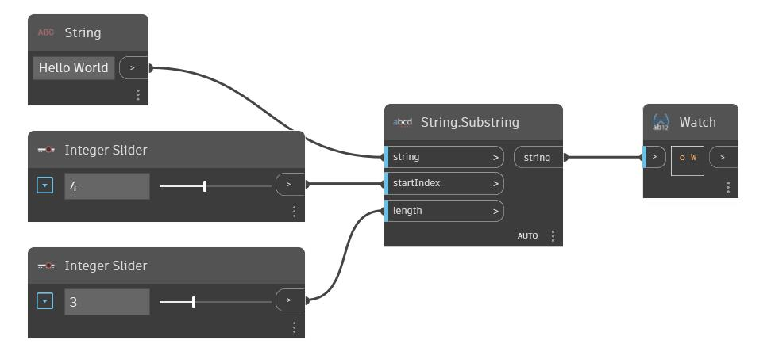

## In Depth
Substring takes an input string and returns a sub string based on the start index and length inputs. In the example below, we start with the string 'Hello World'. Two integer sliders are used to control where to start the substring and how many characters to take.
___
## Example File

