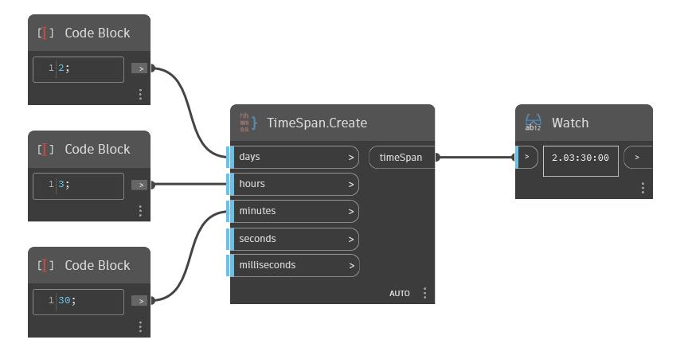

## In Depth
Create will return a new TimeSpan based on days, hours, minutes, seconds, and milliseconds. In the example below, we create the TimeSpan 2.03:30:00, or 2 Days, 3 Hours, and 30 Minutes.
___
## Example File

