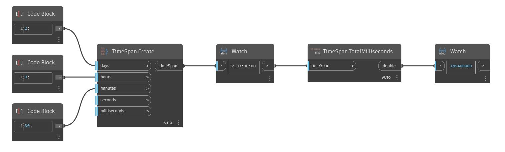

## In Depth
TotalMilliseconds will return the number of milliseconds in a TimeSpan as a double. In the example below, the total number of milliseconds returned from the TimeSpan 2.03:00:00 is 185400000.
___
## Example File

