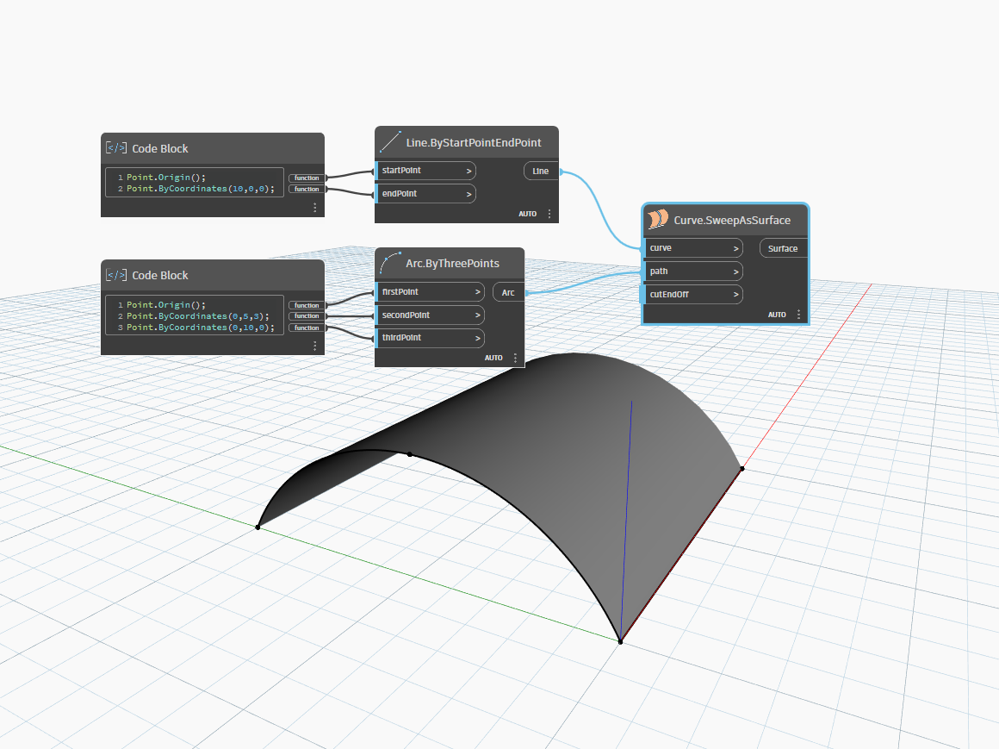

<!--- Autodesk.DesignScript.Geometry.Curve.SweepAsSurface(curve, path, cutEndOff) --->
<!--- DUHOUAQLX67Z6VGX2F6TGNPE2PGYDN7VGCOK6UW3D5GYILRXG3KA --->
## In Depth
`Curve.SweepAsSurface` will create a surface by sweeping an input curve along a specfied path. In the example below, we create a curve to sweep by using a Code Block to create three points of an `Arc.ByThreePoints` node. A path curve is created a simple line along the x-axis. `Curve.SweepAsSurface` moves the profile curve along the path curve creating a surface.
___
## Example File

