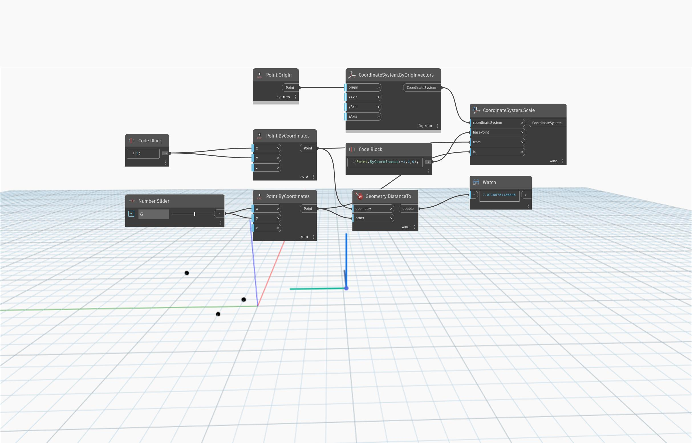

<!--- Autodesk.DesignScript.Geometry.CoordinateSystem.Scale(coordinateSystem, basePoint, from, to) --->
<!--- DXEUCQG4Y4M6N76367ZJYZYJJOLPKVDC5UFPTIBMDW6CC5ORFAXQ --->
## In Depth
`CoordinateSystem.Scale (coordinateSystem, basePoint, from, to)` returns a scaled CoordinateSystem based on a scaling base point, point to scale from, and point to scale to. The `basePoint` input defines where the scaling begins (how much the CoordinateSystem is moved). The distance between the `from` and `to` points defines the amount to scale by. 

In the example below, a `basePoint` of (-1, 2, 0) defines where to scale from. Theds distance between the `from` (1, 1, 0) and `to` (6, 6, 0) points determines how much to scale by.

___
## Example File

