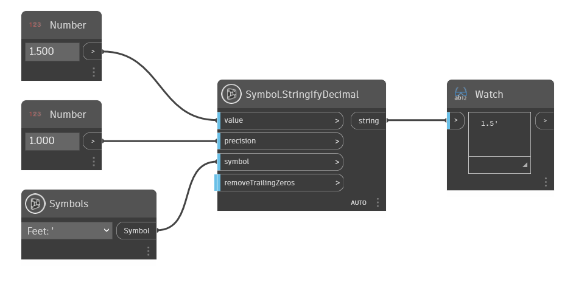

## In Depth
Symbol.StringifyFraction converts the input value into a decimal string representation with the given unit symbol. Also includes a toggle to remove trailing zeros or not.
___
## Example File

