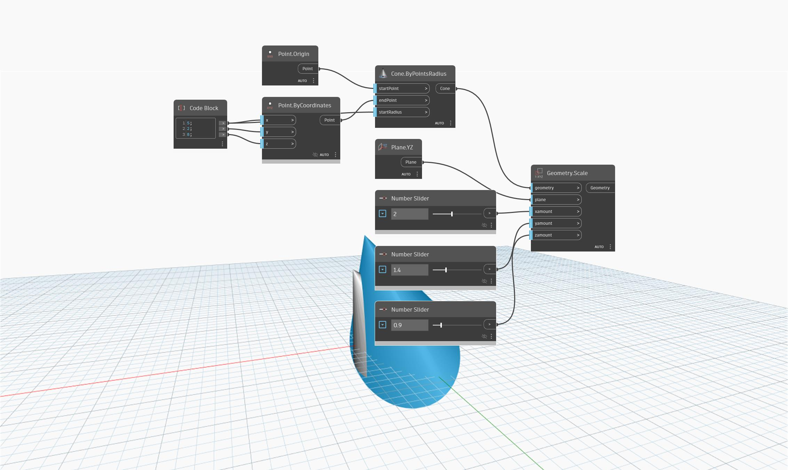

<!--- Autodesk.DesignScript.Geometry.Geometry.Scale(geometry, plane, xamount, yamount, zamount) --->
<!--- EWHQFBJJR5GL3IN7LJ7T7SOY4G24EIBASTHDIRIYQ27HIKC2MGYQ --->
## In Depth
`Geometry.Scale (plane, xamount, yamount, zamount)` scales input geometry about a plane by specified X, Y, and Z factors. 

The example below shows a cone before and after it is scaled in relationship to the YZ-plane.

___
## Example File

