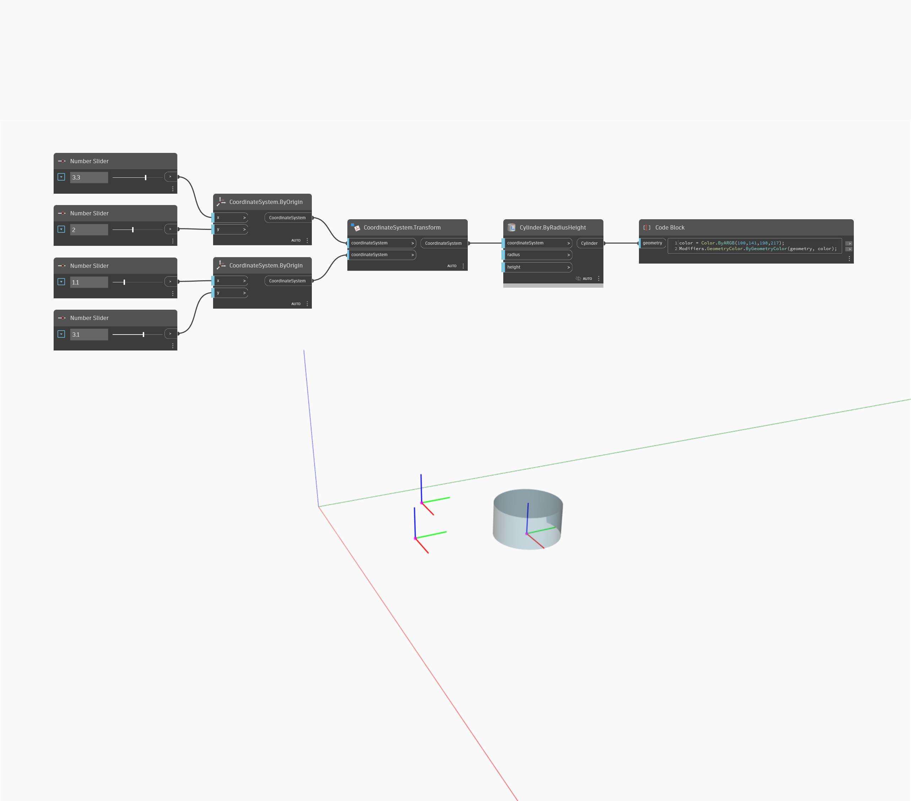

<!--- Autodesk.DesignScript.Geometry.Geometry.Transform(geometry, cs) --->
<!--- FYPDHZXND4VQKFSL7IXEWDONQWVSV7GLPRPS3VGIQTCEC2GVTC7A --->
## In Depth
Transforms geometry by the given CoordinateSystem's transform.
___
## Example File

