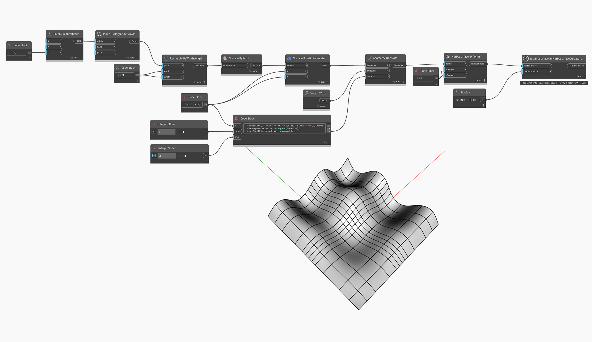

<!--- Autodesk.DesignScript.Geometry.TSpline.TSplineSurface.ByNurbsSurfaceCurvature --->
<!--- GO6D5UXWAXIC6JMDUDLIKMABU2I4XHLVLAL77BROSGFAFN7455KA --->
## In Depth         
In the example below, a NURBS surface of degree 3 is converted into a T-Spline surface using `TSplineSurface.ByNurbsSurfaceCurvature` node. The span counts and positions of the T-Spline surface is detected automatically depending on the curvature.

## Example File

