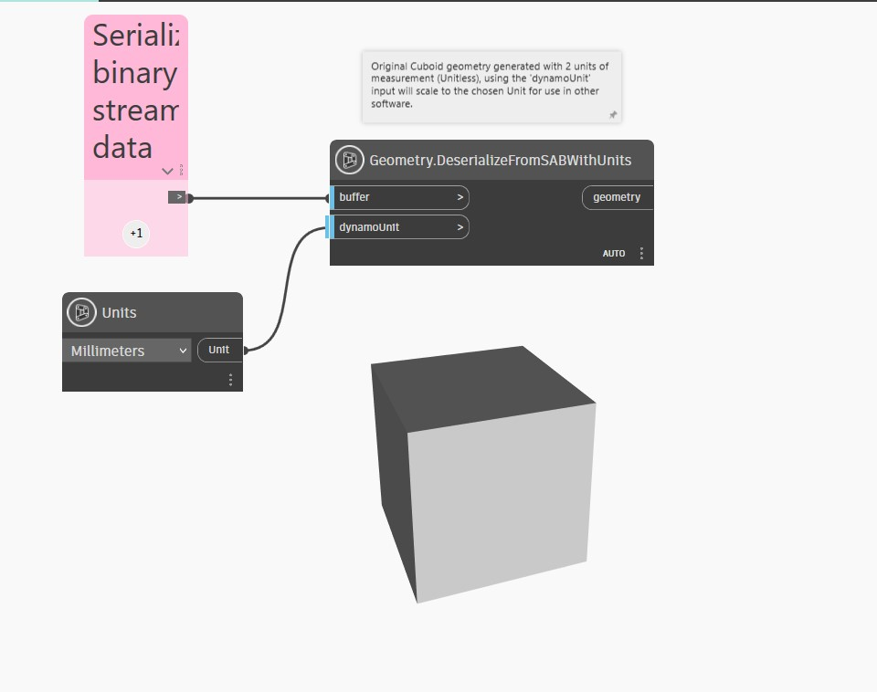

## In Depth
`Geometry.DeserializeFromSABWithUnits` imports geometry to Dynamo from a .SAB (Standard ACIS Binary) byte array and `DynamoUnit.Unit` that is convertible from millimeters. This node takes a byte[] as the first input and a `dynamoUnit` as the second. If the `dynamoUnit` input is left null, this imports the .SAB geometry as unitless, importing the geometric data in the array without any unit conversion. If a unit is provided, the internal units of the .SAB array are converted to the units specified.

Dynamo is unitless, but the numeric values in your Dynamo graph likely still have some implicit unit. You can use the `dynamoUnit` input to scale the internal geometry of the .SAB to that unit system.

In the example below, a cuboid is generated from SAB with 2 units of measurement (unitless). The `dynamoUnit` input scales the chosen unit for use in other software.

___
## Example File

