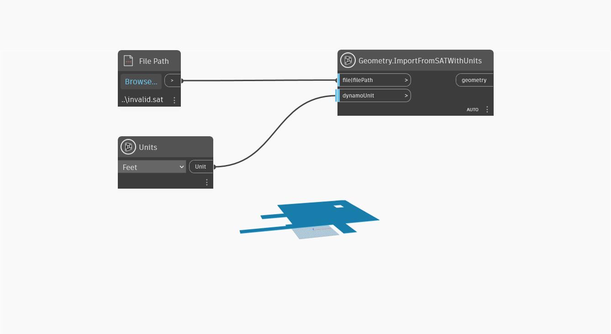

## In Depth
`Geometry.ImportFromSATWithUnits` imports geometry to Dynamo from a .SAT file and `DynamoUnit.Unit` that is convertible from millimeters. This node takes a file object or file path as the first input and a `dynamoUnit` as the second. If the `dynamoUnit` input is left null, the .SAT geometry is imported as unitless, simply importing the geometric data in the file without any unit conversion. If a unit is passed, the internal units of the .SAT file are converted to the specified units.

Dynamo is unitless, but the numeric values in your Dynamo graph likely still have some implicit unit. You can use the `dynamoUnit` input to scale the internal geometry of the .SAT file to that unit system.

In the example below, geometry is imported from a .SAT file, with feet as the unit. To get this example file to work on your computer, download this example SAT file and point the `File Path` node to the invalid.sat file.

___
## Example File

