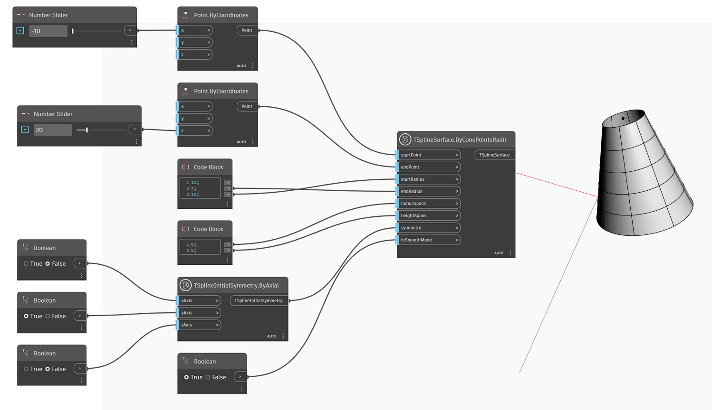

<!--- Autodesk.DesignScript.Geometry.TSpline.TSplineSurface.ByConePointsRadii --->
<!--- H54SEHAY3YGO3MOAVNNGUJ3QI6IP6X6CQRV54A3GDLT46TUD6UHA --->
## In-Depth
In the example below, a T-Spline cone primitive is created using `TSplineSurface.ByConePointsRadii` node. The position and height of the cone are controlled by the two inputs of `startPoint` and `endPoint`. The base and top radii can be adjusted with the `startRadius` and `topRadius` inputs. `radialSpans` and `heightSpans` determine the radial and height spans. The initial symmetry of the shape is specified by the `symmetry` input. If X or Y symmetry is set to True, the value of radial spans must be a multiple of 4. Finally, the `inSmoothMode` input is used to switch between smooth and box mode preview of the T-Spline surface.

## Example File

