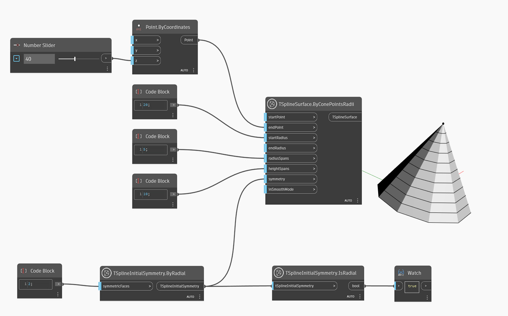

<!--- Autodesk.DesignScript.Geometry.TSpline.TSplineInitialSymmetry.IsRadial --->
<!--- KB37RARA32V2WDFDQAYZ4ZFBA3AOPWGQNDOAMYU4G6VXI5W6TR3Q --->
## In-Depth
In the example below, `TSplineInitialSymmetry.IsRadial` node confirms if type of initial symmetry applied to the T-Spline Surface is radial symmetry. If the node returns False, then the symmetry is of the axial type. 

## Example File

