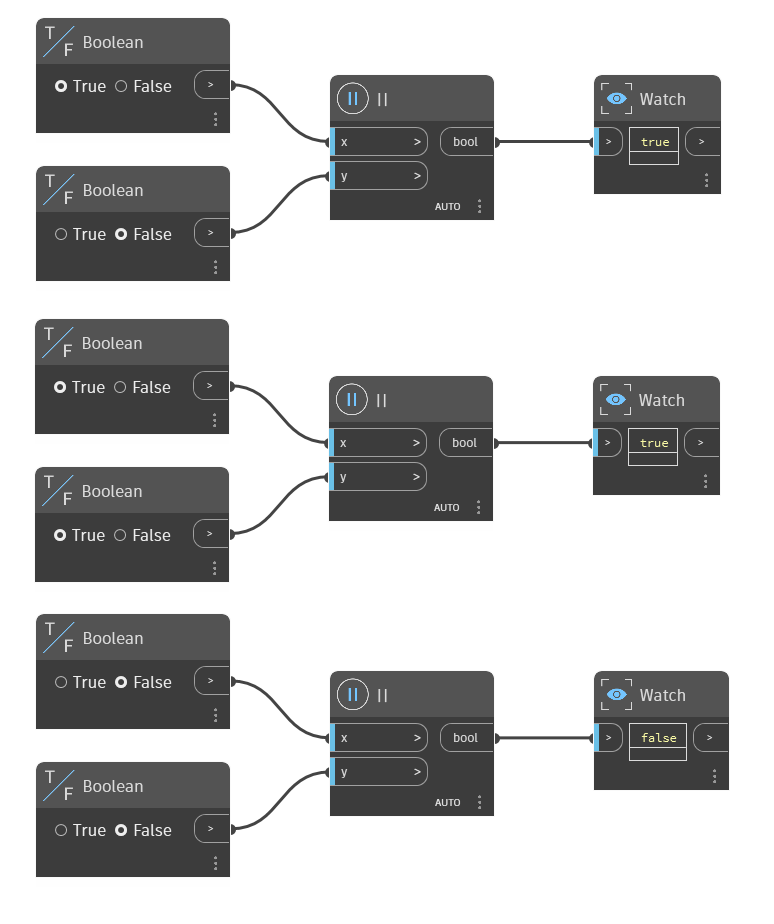

## In Depth
The `||` node is the Or operator. It takes two Boolean values as inputs and returns True if one or both values are True. If both values are False, it returns False. In the example below, three `||` nodes are used to determine if at least one of the input Booleans is True. The first node has a True and False input, so it returns True. The second node has two True inputs, so it returns True. The third node has two False inputs, so it returns False.
___
## Example File

