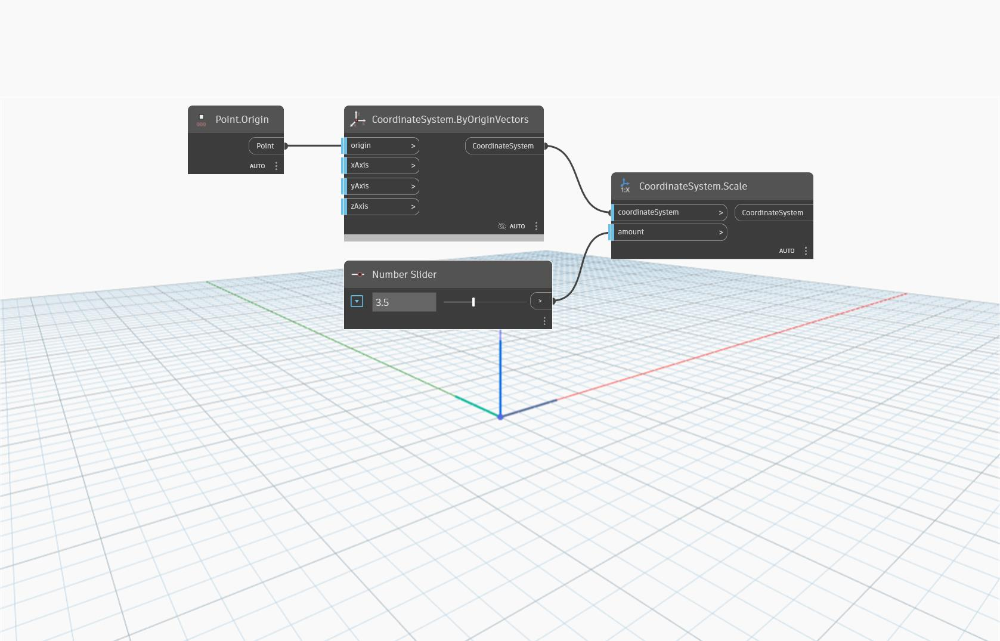

<!--- Autodesk.DesignScript.Geometry.CoordinateSystem.Scale(coordinateSystem, amount) --->
<!--- LH2OMC6QECNGXILBERSJIZPNQ7BJYOSSOBDJC2VICMMYXJ7BJRUA --->
## In Depth
`CoordinateSystem.Scale (coordinateSystem, amount)` returns a new CoordinateSystem scaled by a factor. 

In the example below, a CoordinateSystem at the origin is scaled by a factor of 3.5. The resulting CoordinateSystem has vector lengths and scale factors of 3.5. Adjust the slider for different scale factors.
___
## Example File

