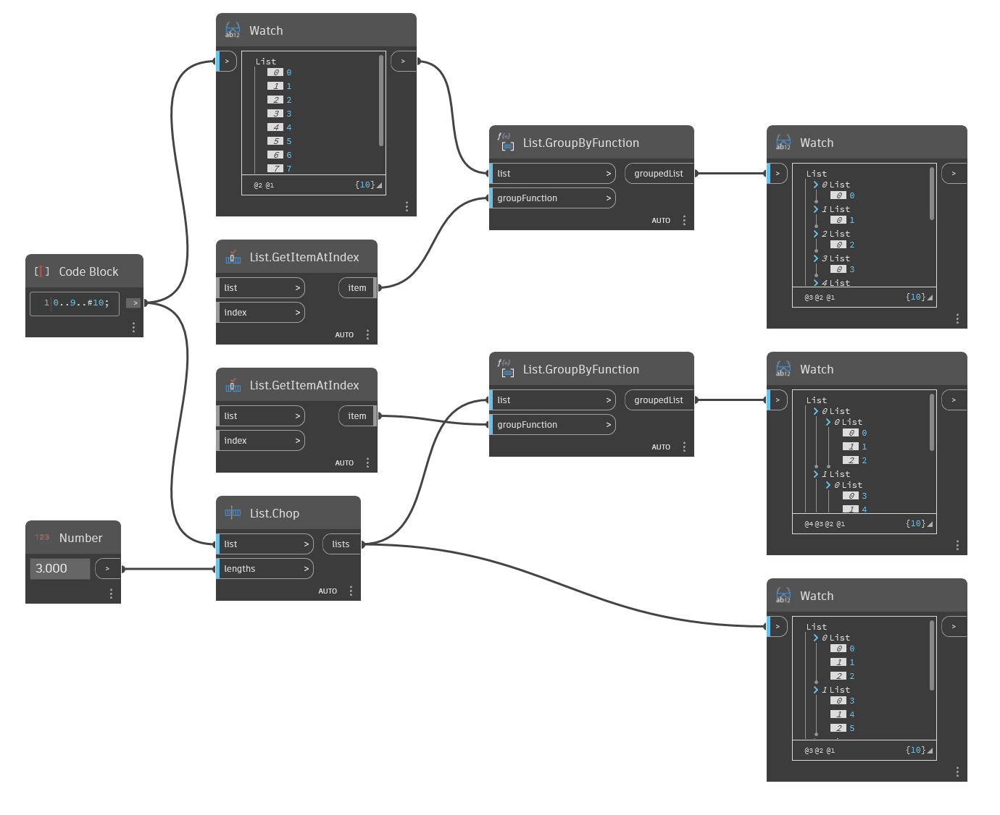

## In Depth
`List.GroupByFunction` returns a new list grouped by a function.  

The `groupFunction` input requires a node in a function state (i.e., it returns a function). This means that at least one of the node’s inputs is not connected. Dynamo then runs the node function on each item in the input list of `List.GroupByFunction` to use the output as a grouping mechanism.

In the example below, two different lists are grouped using `List.GetItemAtIndex` as the function. This function creates groups (a new list) from each top-level index.
___
## Example File

