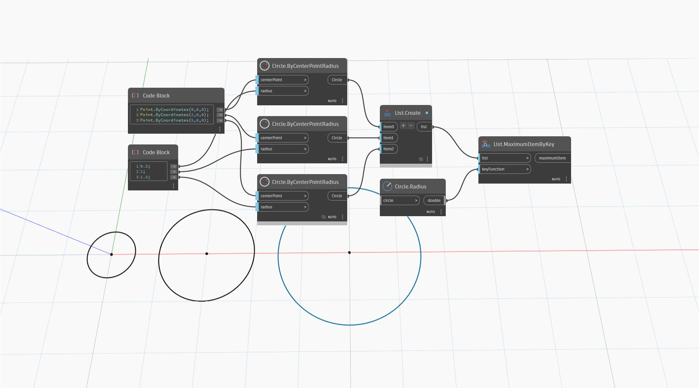

## In Depth
`List.MaximumItemByKey` returns the largest item in a list based on a key function. 

In the example below, a series of three circles with increasing radii are compared using radius as the key. The circle at (5,0,0) is returned, as it has the largest radius.
___
## Example File

