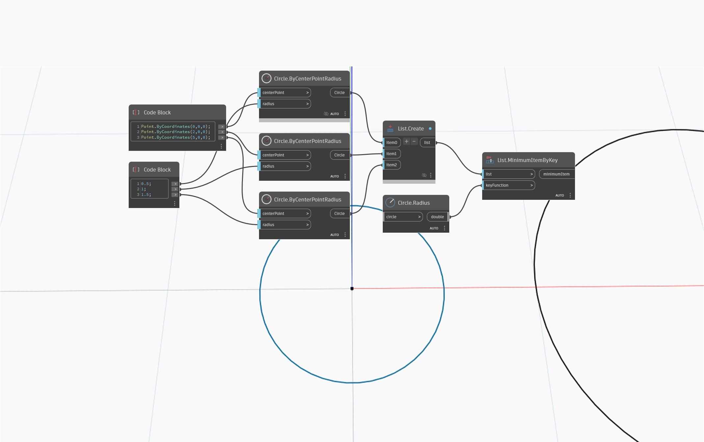

## In Depth
`List.MinimumItemByKey` returns the smallest item in a list based on a key function. 

In the example below, a series of three circles with increasing radii are compared using radius as the key. The circle at the origin is returned, as it has the smallest radius.
___
## Example File

