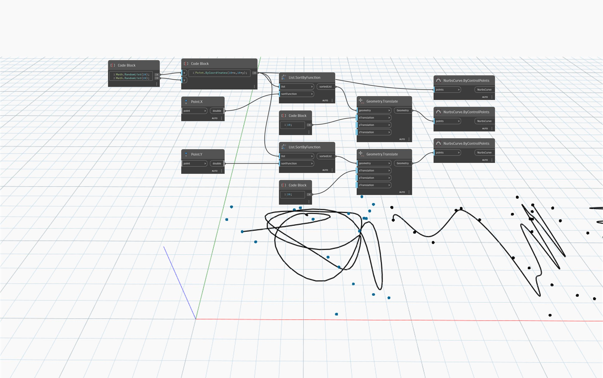

## In Depth
`List.SortByFunction` returns a list sorted by a function.  

In the example below, a line is drawn through a list of randomly placed points that have been sorted with different functions. The first curve through an unsorted list is non-directional. Sorting the list using the X or Y component of each point results in directional lines progressing across X and Y, respectively.
___
## Example File

